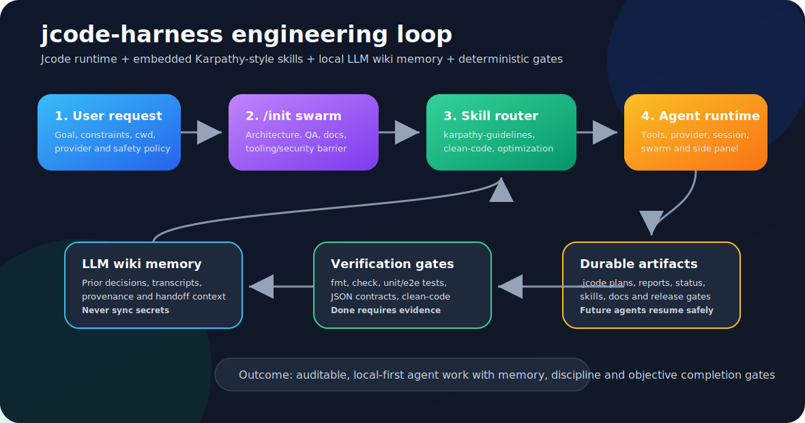

# ⟡ JCode Harness

> A harness-first fork of [jcode](https://github.com/1jehuang/jcode) that combines fast multi-session agent workflows with offline embedded skills, local LLM wiki memory, and deterministic quality gates.

**Visual identity:** JCode Harness keeps the parent project's terminal-native DNA, then adds a cyan/violet harness layer: `JCode` for the fast runtime, `Harness` for the disciplined local engineering loop, and `⟡` for verified handoffs between context, execution, and evidence.

[](LICENSE)
[](https://github.com/1jehuang/jcode/releases)



## At a glance

| Layer | What it contributes | Durable artifact |
| --- | --- | --- |
| Jcode runtime | Fast Rust CLI/TUI, tools, providers, sessions, swarm, side panel, self-dev builds | `src/`, `crates/`, logs, session state |
| Embedded skills | Offline behavioral instructions and deterministic source precedence | `src/skill_pack.rs`, `.jcode/skills/*/SKILL.md` |
| Karpathy guidelines | Practical agent discipline: plan, keep changes surgical, avoid overengineering, verify success | `karpathy-guidelines` built-in skill, vendored source in `third_party/` |
| LLM wiki memory | Prior decisions, transcripts, provenance, handoff context, searchable project memory | wiki pages/raw sessions via local MCP tools |
| Harness governance | `/init` plans, release gates, clean-code checks, JSON/NDJSON contracts, validation snapshots | `.jcode/`, `docs/JCODE_HARNESS_*`, e2e tests |

## What this fork is

This branch is not only a small patch set on top of upstream jcode. It is a product direction called **jcode-harness**.

The goal is to turn jcode into a rigorous local AI engineering harness:

- **Jcode core** supplies the fast Rust CLI/TUI, provider integration, tools, sessions, swarm coordination, self-development flow, side panel, memory, and automation surface.
- **LLM wiki** supplies durable project memory: prior decisions, session transcripts, provenance, handoff context, and searchable project knowledge.
- **Karpathy-inspired skills** supply behavioral guardrails for agent work: think before coding, keep changes surgical, avoid speculative abstractions, and define verifiable success criteria.
- **Harness quality gates** supply deterministic checks before claims of completion: JSON/NDJSON contracts, offline skills, clean-code checks, init swarm analysis, and repeatable tests.

In short: this fork is about making an AI coding agent less improvisational and more like a disciplined engineering runtime.

## How the engineering is put together

The engineering is built as a closed local loop, similar in spirit to the Codex Harness MCP loop: request, context, contract, execution, evidence, gate, and handoff. The difference is that this fork embeds that loop directly into Jcode's Rust runtime and project files.

1. **Request enters Jcode** through the interactive TUI, `jcode run`, `jcode-harness run`, or `/init`. The request is not treated as enough context by itself. It is paired with cwd, provider choice, skill mode, safety policy, and project-local artifacts.
2. **Project bootstrap creates durable structure** under `.jcode/`: init reports, questions, MCP plan, skills plan, side-panel status, and swarm analysis files. This prevents the first agent turn from being a pure chat transcript with no durable output.
3. **The swarm analysis separates concerns**. Architecture, QA, documentation/onboarding, and tooling/security are discovered independently, then synthesis waits on a barrier before writing recommendations.
4. **The skill router narrows behavior**. Coding work gets `karpathy-guidelines` plus `clean-code-guardian`; performance work gets `optimization`; project-memory or prior-decision work gets `llmwiki-memory`. Explicit skills always win, and automatic routing stays conservative.
5. **The LLM wiki is the memory plane**. It is used for prior decisions, transcripts, provenance, and handoff context. It is deliberately not treated as source-code truth, so code claims still need repository/test evidence.
6. **Verification gates close the loop**. `cargo fmt`, focused tests, e2e harness tests, JSON schema checks, clean-code checks, and self-dev builds are the evidence that a change is real.
7. **Artifacts make the work resumable**. Future agents can read README, `docs/CODEX_BOOTSTRAP.md`, `.jcode/init/SWARM_ANALYSIS_REPORT.md`, `.jcode/SKILLS_PLAN.md`, and side-panel status instead of reconstructing intent from chat history.

The image above captures that loop: Jcode receives work, `/init` and swarm analysis create structure, skills constrain behavior, agent runtime performs the task, LLM wiki memory preserves decisions, verification gates prove completion, and durable artifacts make the next session safer.

## Why this exists

Many AI coding tools are powerful but too ephemeral:

1. They forget why earlier decisions were made.
2. They rely on prompt habits that are not enforced or tested.
3. They make broad changes without a local governance loop.
4. They require provider/network access even for behavior that could be local.
5. Their automation output is hard to trust in CI or scripts.

`jcode-harness` attacks those problems with a local-first design:

- reusable skills are embedded into the binary;
- durable knowledge is routed through the local LLM wiki;
- project bootstrap creates explicit plans, questions, risks, and status pages;
- agent runs can be scriptable and machine-readable;
- quality gates are testable without live model credentials.

## Current built-in skills

Built-in skills are compiled into the binary with `include_str!`. They do not require internet access, Node, Claude Code, Cursor, Codex CLI, or plugin marketplaces at runtime.

| Skill | Purpose |
| --- | --- |
| `karpathy-guidelines` | Behavioral guidelines adapted from [`forrestchang/andrej-karpathy-skills`](https://github.com/forrestchang/andrej-karpathy-skills). Use for disciplined coding, review, refactoring, and debugging. |
| `optimization` | Performance, memory, latency, throughput, CPU/RAM, and compile-time improvement work. |
| `clean-code-guardian` | Offline quality policy and rule pack for readable, focused, well-tested code without silent errors. |
| `llmwiki-memory` | Safe use of the local LLM wiki as durable project memory with provenance, transcript sync, prior-decision lookup, and secret boundaries. |

Skill source priority is deterministic:

1. built-in skills;
2. project compatibility skills from `./.claude/skills`;
3. global jcode skills from `~/.jcode/skills`;
4. project-local jcode skills from `./.jcode/skills`.

Later sources override earlier sources with the same skill name. This lets a project override a built-in skill without rebuilding the binary.

## How skill routing works

`jcode-harness run` can prepend selected skill context before an agent run.

The router is intentionally conservative:

- coding, bug, test, refactor, review, implement, fix, pull request, or diff tasks select `karpathy-guidelines` and `clean-code-guardian`;
- performance, latency, memory, throughput, CPU, RAM, or efficiency tasks select `optimization`;
- LLM wiki, project memory, prior decision, provenance, transcript, or context-history tasks select `llmwiki-memory`;
- explicit `--skill <name>` always includes that skill;
- `--skills off` disables automatic routing while preserving explicit skills;
- `--skills always` includes all built-in harness skills.

The router does not inject every skill by default. The point is to keep context relevant and auditable.

## LLM wiki role

The LLM wiki is the memory layer, not source-code truth.

Use it to answer questions like:

- What did we decide last time?
- Which risks were already identified?
- Which validation commands were trusted?
- Where did this architectural constraint come from?
- What should a future agent know before continuing?

But always verify code claims against the repository. Wiki memory can be stale. Source files, tests, and explicit user instructions win.

Secret policy is strict: do not sync tokens, API keys, private keys, `.env` values, provider credentials, deployment secrets, database credentials, cookies, or local session secrets into wiki memory.

## Main commands

### Provider authentication

OpenAI/Codex OAuth uses the local callback URI
`http://localhost:1455/auth/callback` by default. If that port is unavailable,
jcode falls back to a manual paste flow. See `OAUTH.md` for the full provider
auth notes.

### Provider runtime backpressure

Live OpenAI, Anthropic, and OpenRouter requests share two in-process rate-limit
protections per `provider::model`: a short cooldown after retryable 429/rate-limit
responses and a small concurrency semaphore to avoid local request stampedes. The
semaphore defaults to **2 concurrent requests per provider/model**.

Tune it with `JCODE_PROVIDER_MAX_CONCURRENT_PER_MODEL`:

```bash
JCODE_PROVIDER_MAX_CONCURRENT_PER_MODEL=1 jcode
JCODE_PROVIDER_MAX_CONCURRENT_PER_MODEL=0 jcode  # disable the semaphore
```

Use a lower value when a provider account is rate-limited aggressively or when
running many swarm/headless sessions against the same model. Use `0` only for
controlled debugging, because it removes this local backpressure guard while
keeping provider-side limits unchanged.

### Interactive jcode

```bash
jcode
```

### Harness CLI

```bash
jcode-harness
jcode-harness --version
jcode-harness smoke
jcode-harness acp manifest --json
jcode-harness acp serve --stdio
jcode-harness demo --json
jcode-harness demo run mock-provider-run-json --json
jcode-harness demo run all --sandbox --json
jcode-harness session list --json
jcode-harness session list --source jcode --json
jcode-harness session spawn "draft a release plan" --dry-run --json
jcode-harness session spawn "draft a release plan" --dry-run --ndjson
jcode-harness session attach <session-id> --dry-run --json
jcode-harness session attach <session-id> --dry-run --ndjson
jcode-harness session show <session-id> --json
jcode-harness session show <session-id> --preview 3 --json
jcode-harness session resume <session-id> --dry-run --json
jcode-harness session resume <session-id> --dry-run --ndjson
jcode-harness session cancel <session-id> --dry-run --json
jcode-harness session cancel <session-id> --dry-run --ndjson
jcode-harness safe-eval
jcode-harness safe-eval --json
jcode-harness doctor
jcode-harness doctor --json
jcode-harness notify test --dry-run --json
jcode-harness init --yes
```

`jcode-harness --version` exits before starting the TUI, provider setup, or MCP
integrations, and reports the build-time `JCODE_VERSION` generated by
`build.rs`.

### Safe first run

For a cautious first evaluation, create an isolated profile before importing
credentials or enabling high-impact integrations:

```bash
jcode-harness safe-eval
source .jcode/safe-eval/safe-eval.env
jcode-harness run "say hello" --json --mock-response "safe eval ok"
```

The generated profile uses an isolated `JCODE_HOME`, disables telemetry,
ambient/proactive work, swarm auto-coordination, persistent semantic memory,
autoreview, autojudge, gateway exposure, and external credential auto-trust. It
also writes `.jcode/safe-eval/README.md` with a trust checklist and PowerShell
activation file.

Use `jcode-harness doctor --json` for offline diagnostics before running live
providers. It reports safe-eval activation, telemetry opt-out state, platform,
user-attention alert configuration, skill loading health, and project/global MCP
config paths without contacting model providers or starting MCP/browser/Gmail
integrations.

Human-attention sounds are opt-in and silent by default for CI/headless runs. Set
`JCODE_USER_ATTENTION=bell` or `JCODE_NOTIFY_SOUND=1` to enable the initial
terminal bell backend, or `JCODE_USER_ATTENTION=off` to force silence. Use
`jcode-harness notify test --dry-run --json` to inspect the routing without
emitting `\a`. To verify the permission-request path, run
`jcode-harness notify test --event human-intervention --dry-run --json`.
When enabled,
background task completions that requested `notify` or `wake`, plus ambient
permission requests and foreground tool stdin prompts that need human approval,
emit one terminal bell byte to stderr before the usual user-facing
completion/notification fan-out, keeping stdout and JSON streams clean.

The structured execution-event foundation lives in
[`docs/HARNESS_EVENTS.md`](docs/HARNESS_EVENTS.md), with the consumer protocol
and CI guide in
[`docs/HARNESS_EVENTS_PROTOCOL.md`](docs/HARNESS_EVENTS_PROTOCOL.md). The first
slice provides a versioned `HarnessEvent` schema, default payload redaction,
in-process `HarnessEventBus`, local NDJSON logs, replay helpers, SSE framing,
and benchmark baselines; follow-up issues add live local endpoints, broker
adapters, and interactive control transports.

### Headless session metadata

The first programmatic runtime slice is a read-only session inventory command for
scripts and dashboards that need session metadata without scraping or starting the
TUI:

```bash
jcode-harness session list --json
jcode-harness session list --source jcode --json
jcode-harness session spawn "draft a release plan" --dry-run --json
jcode-harness session spawn "draft a release plan" --dry-run --ndjson
jcode-harness session attach <session-id> --dry-run --json
jcode-harness session attach <session-id> --dry-run --ndjson
jcode-harness session show <session-id> --json
jcode-harness session show <session-id> --preview 3 --json
jcode-harness session resume <session-id> --dry-run --json
jcode-harness session resume <session-id> --dry-run --ndjson
jcode-harness session cancel <session-id> --dry-run --json
jcode-harness session cancel <session-id> --dry-run --ndjson
```

`session spawn --dry-run --json` returns a safe `jcode run --json <goal>`
argv/cwd envelope for creating a new headless run/session without starting a
provider, TUI, network, or credential flow. Omitting `--dry-run` fails safely
because the harness does not execute spawn flows yet.

`session attach --dry-run --json` validates a local jcode session id and returns
the current safe attach envelope for an operator-selected execution surface
without starting the TUI/provider flow or emitting transcript content. Omitting
`--dry-run` fails safely because the harness does not execute attach flows yet.

`session spawn|attach|resume|cancel --dry-run --ndjson` emits deterministic
newline-delimited `start`, `envelope`, and `done` events for dashboards and
external orchestrators while preserving the same offline/read-only safety
guarantees as `--json`.

`session show` currently supports local jcode sessions. It emits metadata only by
default, and transcript content appears only when a bounded `--preview N` is
requested.

`session resume --dry-run --json` validates a local jcode session id and returns
the exact `jcode --resume <id>` argv/cwd envelope without starting the TUI,
provider flow, network, or credentials. Omitting `--dry-run` fails safely because
the harness does not execute resume flows yet.

`session cancel --dry-run --json` records an offline cancellation intent envelope
for a known or unknown local session id. It does not contact running sessions,
providers, tools, the network, credentials, or the TUI; optional `--request-id`
and `--reason` values are echoed for external orchestrators. Omitting
`--dry-run` fails safely because live cancellation is reserved for a later
runtime slice.

The session commands are offline/read-only. The inventory command hides debug and
canary sessions by default, and supports `--include-test`,
`--source all|jcode|claude-code|codex|pi|opencode`, and `--limit N` for
deterministic automation.

### ACP preview

Issue #3 starts with a conservative ACP preview surface. It does not claim full
registry readiness yet, and it does not start providers, tools, or the TUI:

```bash
jcode-harness acp manifest --json
jcode-harness acp fixture --json
jcode-harness acp serve --stdio
```

`acp manifest --json` prints supported preview methods, safety guarantees, and
registry gaps. `acp serve --stdio` speaks newline-delimited JSON-RPC 2.0 for the
implemented `initialize`, `initialized` notification, `shutdown`, and safe
offline `jcode/session.list|show|spawn|attach|resume|cancel` request methods,
plus the standards-friendly `$/cancelRequest` notification as an offline no-op.
Session methods reuse the same read-only/dry-run envelopes as the CLI and still
avoid starting providers, tools, network,
credentials, or the TUI. `jcode/session.cancel` returns a structured offline
control envelope for known or unknown sessions without contacting live provider
or session processes. `acp fixture --json` prints a versioned conformance
fixture with newline-delimited JSON-RPC requests, expected responses, and a tiny
local session file that clients can copy into a temporary `JCODE_HOME` for
deterministic offline tests.

### Reproducible demos without credentials

Issue/README claims should be reproducible without provider keys, network calls,
browser windows, or MCP server startup. The `demo` command prints a deterministic
manifest for safe-eval, mock-provider, memory, plan, swarm, browser, skills, and
release-gate demos:

```bash
jcode-harness demo --json
jcode-harness demo run mock-provider-run-json --json
```

Some demos intentionally write scaffold or smoke-test files. They are blocked by
default unless you opt into writes. Prefer the sandbox path, which executes all
demos in a temporary workspace and removes it after the JSON report is rendered:

```bash
jcode-harness demo run all --sandbox --json
```

Use `--keep-sandbox` only when you want to inspect the generated files manually.
Use `--allow-writes` only in a disposable or already activated safe-eval
workspace.

### Skills

```bash
jcode-harness skills list
jcode-harness skills list --json
jcode-harness skills show karpathy-guidelines
jcode-harness skills show llmwiki-memory --json
jcode-harness skills sync
jcode-harness skills doctor --json
jcode-harness skills scope init --json
jcode-harness skills scope set optimization --state blocked --reason "benchmark-only" --json
jcode-harness skills scope list --json
jcode-harness skills import --json
jcode-harness skills import --from .claude/skills --apply --json
jcode-harness skills validate --cwd . --json
```

`skills scope` manages `.jcode/skills.scope.json`, a repo-local policy that can
mark skills as `visible`, `discoverable`, or `blocked`. `visible` skills can be
auto-routed, `discoverable` skills only run when explicitly requested with
`--skill`, and `blocked` skills are removed from both automatic and explicit
selection. `jcode-harness run --dry-run` and `skills match --json` both honor
this policy.

`skills import` is safe-by-default: without `--apply` it only previews a local
import plan. By default it scans `.agents/skills`, `.claude/skills`,
`.codex/skills`, and `.jcode/skills`, then targets project-local
`.jcode/skills`. Use `--scope global` for `$JCODE_HOME/skills`, and `--force`
with `--apply` only when you intentionally want to overwrite existing target
files.

`skills validate` is an offline CI-friendly gate for the Skill OS. It checks
built-in, Claude-compatible, global, and project-local skill files for required
frontmatter, runtime-compatible `allowed-tools` strings or YAML lists, duplicate
precedence, empty bodies, prompt-injection phrases, suspicious inline secrets,
and risky shell snippets before a model ever sees the prompt.

### Scriptable runs

```bash
jcode-harness run "review this diff" --skill karpathy-guidelines --max-turns 3 --json
jcode-harness run "query prior architecture decisions" --dry-run
jcode-harness run "optimize this Rust hot path" --skills auto --dry-run
```

For CI and contract tests, use the deterministic mock provider:

```bash
jcode-harness run "review this diff" --json --mock-response "deterministic response"
jcode-harness run "review this diff" --ndjson --mock-response "deterministic response"
```

### Clean Code Guardian

```bash
jcode-harness clean-code check --json
jcode-harness clean-code check src tests --fail-on warning
jcode-harness clean-code rules
```

## Project bootstrap with `/init`

The fork adds a harness-oriented init flow.

`/init` and `jcode-harness init` generate project-local scaffolding under `.jcode/`, including:

- `.jcode/INIT_REPORT.md`
- `.jcode/INIT_QUESTIONS.md`
- `.jcode/SKILLS_PLAN.md`
- `.jcode/MCP_PLAN.md`
- `.jcode/init/SWARM_ANALYSIS_PLAN.md`
- `.jcode/init/SWARM_ANALYSIS_REPORT.md`
- `.jcode/side_panel/status.md`

The default interactive `/init` path queues an LLM-driven swarm analysis after static scaffolding. Required discovery roles are architecture, QA, documentation/onboarding, and tooling/security. Synthesis is blocked on a report barrier before final recommendations are written.

Use deterministic scaffold-only mode when needed:

```bash
/init --no-swarm
```

## Installation

For upstream stable jcode installation:

```bash
curl -fsSL https://raw.githubusercontent.com/1jehuang/jcode/master/scripts/install.sh | bash
```

For this fork or local development, build from source:

```bash
git clone https://github.com/chapzin/jcode-harness.git
cd jcode-harness
cargo build -p jcode --bin jcode
cargo build -p jcode --bin jcode-harness
```

When working inside the self-development harness, prefer coordinated builds:

```text
selfdev build target=auto
```

Fallback local build:

```bash
scripts/dev_cargo.sh build --profile selfdev -p jcode --bin jcode
```

## Validation gates

Common focused checks:

```bash
cargo fmt --check
cargo check -p jcode
cargo test -p jcode project_init --lib -- --nocapture
cargo test -p jcode test_init_command --lib -- --nocapture
cargo test -p jcode skill_router --lib
cargo test -p jcode skill::tests --lib
cargo test -p jcode clean_code --lib
cargo test --test e2e harness_cli -- --nocapture
cargo run -q -p jcode --bin jcode-harness -- skills list --json | python3 -m json.tool >/dev/null
cargo run -q -p jcode --bin jcode-harness -- skills show llmwiki-memory --json | python3 -m json.tool >/dev/null
cargo run -q -p jcode --bin jcode-harness -- skills doctor --json | python3 -m json.tool >/dev/null
```

Release-readiness gates live in [`docs/JCODE_HARNESS_RELEASE_GATES.md`](docs/JCODE_HARNESS_RELEASE_GATES.md). A release candidate is not ready just because it compiles. It must satisfy CLI contracts, offline skill behavior, deterministic quality gates, documentation, JSON compatibility, and upstream-divergence review.

## Repository map

Important paths for this fork:

| Path | Meaning |
| --- | --- |
| `src/main.rs` | Primary `jcode` CLI/TUI binary. |
| `src/bin/harness.rs` | `jcode-harness` automation-facing binary. |
| `src/project_init.rs` | Init scaffolding and swarm bootstrap. |
| `src/skill.rs` | Skill loading, precedence, parsing, reload behavior. |
| `src/skill_pack.rs` | Built-in skill registry compiled with `include_str!`. |
| `src/skill_router.rs` | Deterministic task-to-skill routing. |
| `.jcode/skills/` | Project-local skill definitions, including built-in source files for this fork. |
| `.jcode/quality/` | Clean Code Guardian rule pack. |
| `third_party/andrej-karpathy-skills/` | Vendored upstream Karpathy-inspired skill material and attribution-sensitive source. |
| `docs/SKILLS_HARNESS.md` | Skills harness operating docs. |
| `docs/CODEX_BOOTSTRAP.md` | Continuation notes for future agents. |
| `docs/SKILLS_HARNESS_STATUS.md` | Implementation status and validation snapshot. |
| `docs/JCODE_HARNESS_RELEASE_GATES.md` | Release-readiness gates. |

## Security boundaries

- Built-in skill loading must remain local/offline.
- MCP setup is review-first. Do not auto-install remote MCP servers or persist credentials without explicit review.
- LLM wiki memory must never contain secrets.
- Provider/auth, telemetry, release, browser automation, and email/Gmail tooling are sensitive integration surfaces.
- Destructive or externally visible actions, such as deployment, publishing, database writes, or sending emails, require explicit confirmation.

## Compatibility with upstream jcode

This fork preserves upstream jcode behavior where practical:

- `jcode run`
- `jcode serve`
- `jcode connect`
- existing provider integrations
- the fast Rust TUI/session workflow

Fork-specific behavior is documented as `jcode-harness` behavior. The goal is not to remove upstream capabilities, but to add a disciplined harness layer around them.

## Further reading

- [Skills Harness](docs/SKILLS_HARNESS.md)
- [Clean Code Guardian](docs/CLEAN_CODE_GUARDIAN.md)
- [Product Engineering Plan](docs/JCODE_HARNESS_PRODUCT_PLAN.md)
- [Release Readiness Gates](docs/JCODE_HARNESS_RELEASE_GATES.md)
- [JSON Schemas](docs/JCODE_HARNESS_JSON_SCHEMAS.md)
- [Init Swarm Bootstrap](docs/JCODE_HARNESS_INIT_SWARM.md)
- [Codex Bootstrap](docs/CODEX_BOOTSTRAP.md)
- [Crate Ownership Boundaries](docs/CRATE_OWNERSHIP_BOUNDARIES.md)

## Attribution

This fork vendors selected Karpathy-inspired skill material from [`forrestchang/andrej-karpathy-skills`](https://github.com/forrestchang/andrej-karpathy-skills) under `third_party/andrej-karpathy-skills/` and adapts it into the built-in `karpathy-guidelines` skill. See [`NOTICE.md`](NOTICE.md).

jcode remains open source under the repository license. See [`LICENSE`](LICENSE).
